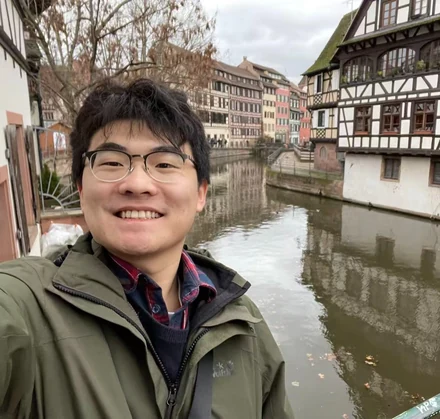
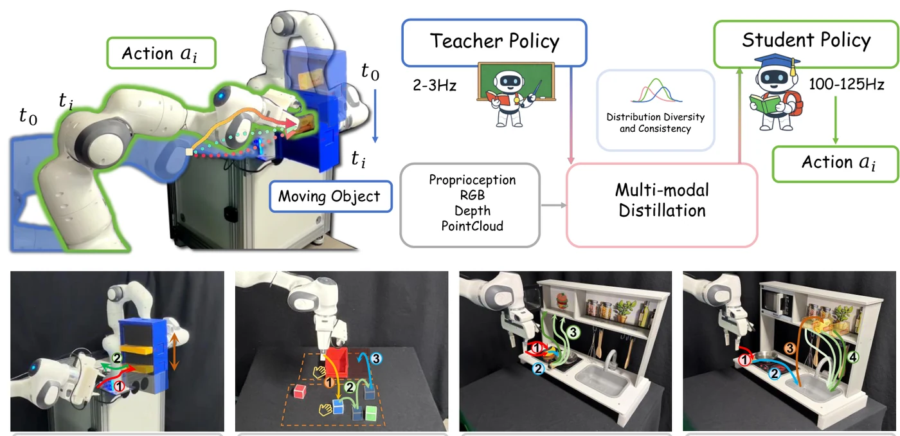
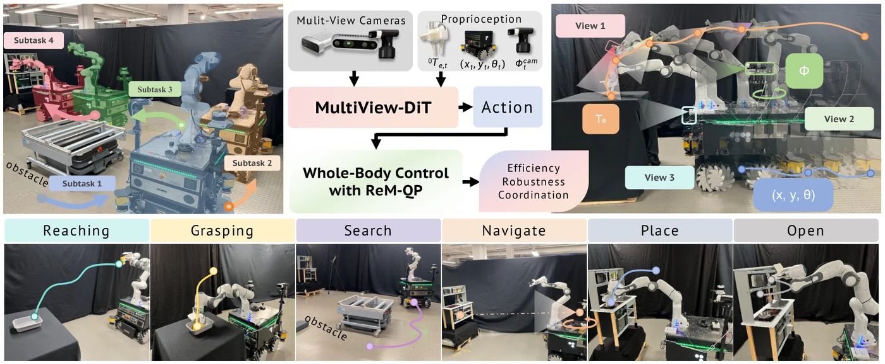

# Academic Page Story of Ju Dong

## About Me

I am a PhD candidate at TAMS (Technical Aspects of Multimodal Systems), Department of Informatics, University of Hamburg, supervised by Prof. [Jianwei Zhang](https://tams.informatik.uni-hamburg.de/people/zhang/). I work closely with the Chair of Robotics, Artificial Intelligence and Real-Time Systems at the Technical University of Munich and with the AI department at Agile Robots SE in Munich.

My research focuses on generative policies for robotic manipulation — how robots learn multi-modal behaviors from human demonstrations and execute them reliably on real hardware. Recent work spans multi-view diffusion policies for mobile manipulation, one-step distillation of flow-matching policies for real-time closed-loop control, vision-language-action models for bimanual manipulation, and benchmarks for safe, responsible robot behavior.

I care about the gap between what a policy achieves in simulation and what survives contact with a real robot. Learned policies generalize but are often too slow or too brittle for closed-loop control; classical controllers are stable but rigid. My work sits at that boundary, combining generative models with control-theoretic structure so the resulting systems are both adaptive and dependable.

## Links

[Email](mailto:ju.dong@uni-hamburg.de)
[Google Scholar](https://scholar.google.com/citations?user=fmoG1a4AAAAJ)
[GitHub](https://github.com/Ju6276)

## News

+ May 2026: Presented "Mobile Bimanual Manipulation" at the TAMS Oberseminar, University of Hamburg.

+ Mar 2026: Our paper "From Flow to One Step: Real-Time Multi-Modal Trajectory Policies via Implicit Maximum Likelihood Estimation-based Distribution Distillation" is accepted by IROS 2026.

+ Mar 2026: Completed my M.Sc. in Mechatronics and Robotics at the Technical University of Munich.

+ Jan 2026: Our paper "M4Diffuser: Multi-View Diffusion Policy with Manipulability-Aware Control for Robust Mobile Manipulation" is accepted by ICRA 2026.

+ Dec 2025: Released "ResponsibleRobotBench", a benchmark for evaluating responsible robot manipulation with multi-modal large language models.

+ Mar 2025: Joined the Artificial Intelligence department at Agile Robots SE in Munich.

## Selected Publications

+ 
  From Flow to One Step: Real-Time Multi-Modal Trajectory Policies via Implicit Maximum Likelihood Estimation-based Distribution Distillation, **Ju Dong\***, Liding Zhang, Lei Zhang\*, Yu Fu, Kaixin Bai, Zoltán-Csaba Márton, Zhenshan Bing, Zhaopeng Chen, Alois Christian Knoll, and Jianwei Zhang, IEEE/RSJ International Conference on Intelligent Robots and Systems (IROS 2026). \*Equal contribution. [[arXiv](https://arxiv.org/abs/2603.09415)] [[Project Page](https://sites.google.com/view/flow2one)]
  Distills a Conditional Flow Matching expert into a single-step student policy via Implicit Maximum Likelihood Estimation, using a bi-directional Chamfer objective to preserve multi-modality instead of collapsing to averaged trajectories. Achieves 70.0% success at 125 Hz on real hardware — a 43x speedup over the multi-step teacher.

+ 
  M4Diffuser: Multi-View Diffusion Policy with Manipulability-Aware Control for Robust Mobile Manipulation, **Ju Dong**, Lei Zhang, Liding Zhang, Yao Ling, Yu Fu, Kaixin Bai, Zoltán-Csaba Márton, Zhenshan Bing, Zhaopeng Chen, Alois Christian Knoll, and Jianwei Zhang, IEEE International Conference on Robotics and Automation (ICRA 2026). [[arXiv](https://arxiv.org/abs/2509.14980)] [[Project Page](https://sites.google.com/view/m4diffuser)]
  A multi-view diffusion transformer generates end-effector goals in the world frame, executed by ReM-QP — a whole-body QP controller that drops slack variables for efficiency and adds an inverse-condition-number manipulability preference for stability near singularities. 7–56% higher success rates and 3–31% fewer collisions than baselines.

+ ResponsibleRobotBench: Benchmarking Responsible Robot Manipulation using Multi-Modal Large Language Models, Lei Zhang, **Ju Dong**, Kaixin Bai, Minheng Ni, Zoltán-Csaba Márton, Zhaopeng Chen, and Jianwei Zhang, Under review at IEEE Transactions on Robotics (T-RO), 2026. [[arXiv](https://arxiv.org/abs/2512.04308)]
  A benchmark for whether LMM-powered agents can identify physical hazards, plan corrective behavior, and complete manipulation tasks safely — spanning hazard types, planning difficulty, and adversarial instruction intent, evaluated across high-level skills, low-level pose actions, and executable code generation.

## Patents

+ Pipeline Inspection Robot, J. Gu, F. He, Z. Tian, K. Wang, Y. Xin, and **J. Dong**, Chinese Patent CN210219051U, granted Mar. 2020.

## Education

+ Ph.D. in Informatics, University of Hamburg, Germany. TAMS (Technical Aspects of Multimodal Systems), advised by Prof. Jianwei Zhang. 2026–present.

+ M.Sc. in Mechatronics and Robotics, Technical University of Munich, Germany. GPA 1.3/1.0. Master thesis: "Multi-Modal Bimanual Robotic Manipulation via Vision-Language-Action Models." 2023–2026.

## Experience

+ Working Student, Artificial Intelligence Department, Agile Robots SE, Munich, Germany. Mar 2025–present.
  Developed, trained, and deployed diffusion policies on a dual-arm robotic platform; built a benchmark for evaluating LLMs/VLMs in responsible robotic manipulation; implemented high-speed ball catching with a dexterous robotic hand.

## Talks

+ May 2026: Mobile Bimanual Manipulation, TAMS Oberseminar, University of Hamburg, Germany.
